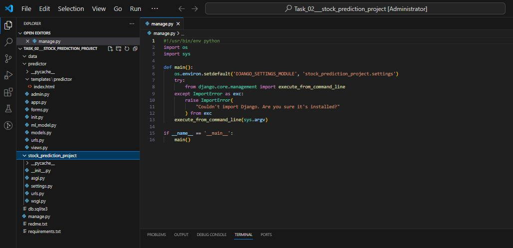
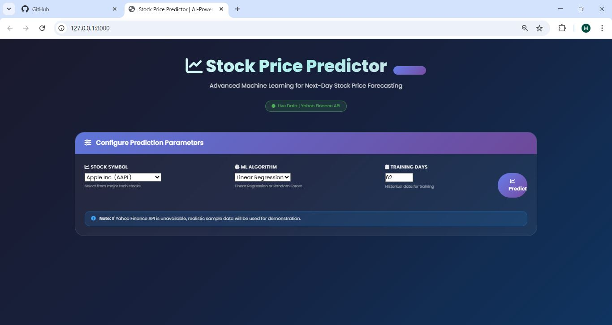
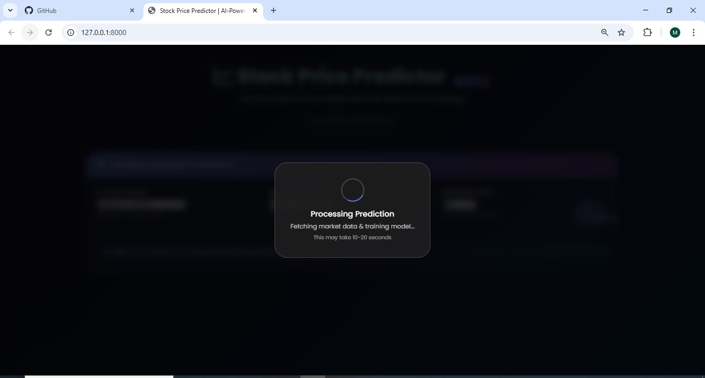
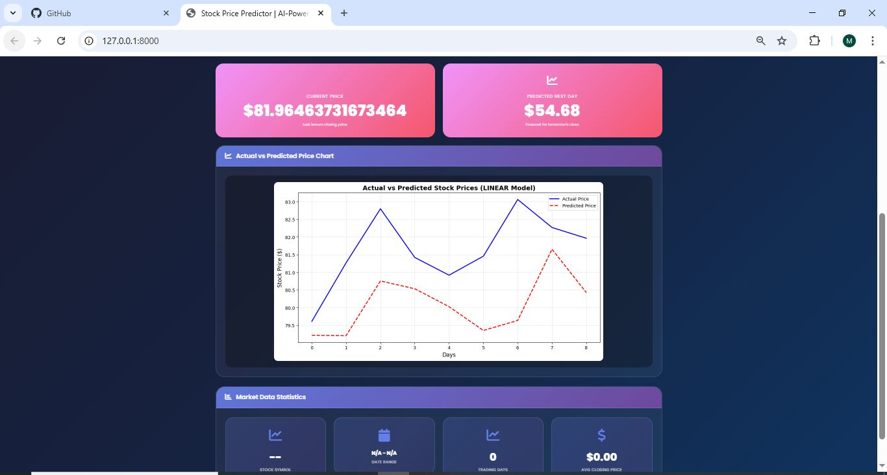
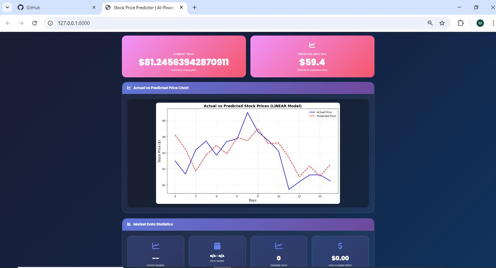

# 📈 Stock Price Prediction - Future Price Forecasting Project

[](https://www.python.org/)
[](https://www.djangoproject.com/)
[](https://scikit-learn.org/)
[](https://pypi.org/project/yfinance/)
[](LICENSE)

A powerful Machine Learning web application that predicts next-day stock closing prices using historical market data. Built with Django, yfinance, and advanced ML algorithms.

---

## 📸 Project Screenshots

### 🗂️ Project Structure
Complete project structure for better understanding.



### 🖥️ Main GUI Interface
The main interface showing stock selection and prediction configuration.



### ⚙️ Processing & Prediction
Real-time data processing and prediction generation.



### 📊 Program with Chart - Visualization
Interactive chart showing actual vs predicted values.



### 📈 Extended Analysis - 100 Training Days
Comprehensive prediction results with 100 days of training data.



---

## 📊 Project Overview

This project uses historical stock market data from Yahoo Finance to predict next-day closing prices using Machine Learning algorithms. The application provides:

- **Real-time Stock Data**: Fetches live data from Yahoo Finance API
- **Multiple ML Models**: Linear Regression and Random Forest algorithms
- **Feature Engineering**: Moving averages, price changes, volume indicators
- **Interactive Web Interface**: User-friendly Django-based GUI
- **Performance Metrics**: RMSE, R² Score, and visualization plots

---

## 🎯 Features

### ✅ Data Collection
- **yfinance Integration**: Real-time stock data from Yahoo Finance
- **Multiple Stocks**: Support for AAPL, TSLA, MSFT, GOOGL, AMZN, META, NFLX
- **Custom Date Ranges**: Adjustable training periods (30-365 days)

### ✅ Feature Engineering
- **Technical Indicators**: Moving averages (MA5, MA10, MA20)
- **Price Metrics**: Open-Close difference, High-Low difference
- **Volume Analysis**: Price change, volume change percentages

### ✅ Machine Learning Models
- **Linear Regression**: Simple and interpretable
- **Random Forest**: Advanced ensemble method
- **Model Evaluation**: RMSE, R² Score metrics

### ✅ Visualizations
- **Actual vs Predicted Plot**: Compare model performance
- **Confidence Intervals**: Prediction error visualization
- **Feature Importance**: For Random Forest model

### ✅ Interactive GUI
- **Modern Glassmorphism Design**: Professional look and feel
- **Real-time Predictions**: Instant results
- **Responsive Layout**: Works on all devices

---

## 🚀 Installation & Setup

### Prerequisites
- Python 3.9 or higher
- pip package manager
- Internet connection (for Yahoo Finance API)

### Step-by-Step Installation

1. **Clone the repository**
```bash
git clone https://github.com/Engr-Yasin-ai-04/stock-price-prediction.git
cd stock-price-prediction
